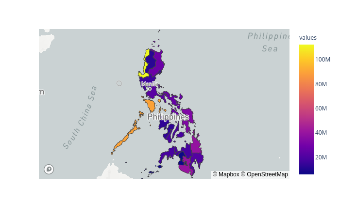

# Geograhical Dataset, Geopandas, and Plotly

Jupyter notebook on how to merge shapefile with data points and visualizing in plotly

## Project Tree
```
.
├── data # data used in jupyter notebook
├── Geographical Dataset, Geopandas, and Plotly.pdf
├── Geographical Dataset, Geopandas, and Plotly.py
└── README.md
```

## Results in Plotly



